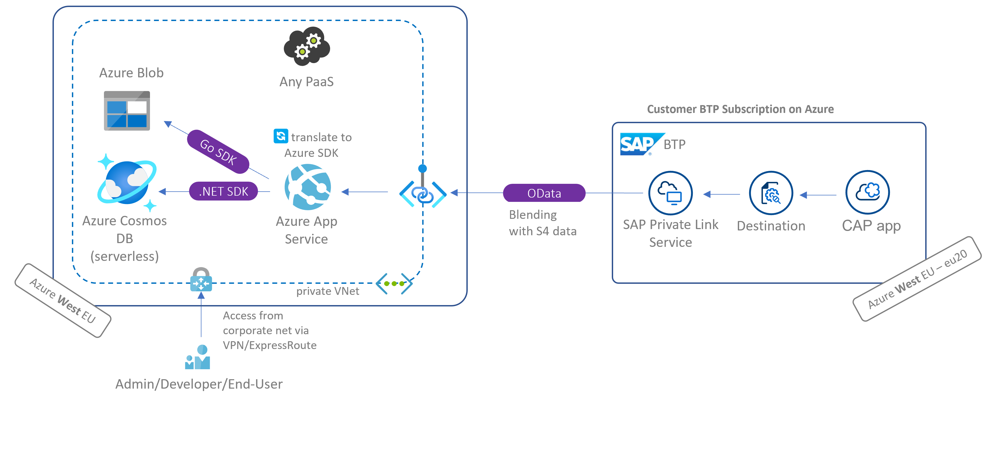

# sap-cap-cosmos-app
SAP [Cloud Application Programming](https://cap.cloud.sap/docs/) (CAP) model implementation of [Azure CosmosDB OData proxy](https://github.com/MartinPankraz/AzCosmosDB-OData-Shim) integration. The cds service serves as proxy to the CloudFoundry destination and ultimately the OData services exposed by the .NET web api running in Azure, which collects data from [Azure CosmosDB](https://learn.microsoft.com/azure/cosmos-db/introduction). The SAPUI5 part of the application is identical to the non-cap implementation [here](https://github.com/MartinPankraz/SAPUI5-CosmosDB-umbrella).

> **Warning**: comment the SAP Private Link in [mta.yaml](mta.yaml) in case you don't want use it.

Additional Resources |
--- |
[blog on the SAP community](https://blogs.sap.com/2023/04/24/sap-private-linky-swear-with-azure-enabling-sap-cap-with-azure-services-without-odata-apis-using-sap-private-link/) |
[OData proxy project](https://github.com/MartinPankraz/AzCosmosDB-OData-Shim) |
[SAPUI5 freestyle client](https://github.com/MartinPankraz/SAPUI5-CosmosDB-umbrella) |
[Geodes pattern implementation with OData proxy](https://blogs.sap.com/2021/06/11/sap-where-can-i-get-toilet-paper-an-implementation-of-the-geodes-pattern-with-s4-btp-and-azure-cosmosdb/) |
<br>



## How to run
From your IDE run `cds watch` (consider default-env.json when using CF destination)

## How to debug
Create Run configuration on SAP BAS and execute or use process attach on VSC. I found [this](https://developers.sap.com/tutorials/appstudio-cap-app.html#61399eba-7ffb-4764-b8bd-4e6036c18e19) link useful. See also my [dedicated post](https://blogs.sap.com/2021/10/05/btp-private-linky-swear-with-azure-how-do-i-debug-and-test-with-live-data/) on the SAP Private Link series-

## How to deploy
Login with your CloudFoundry space, run
```
mbt build
```
and finally
```
cf deploy mta_archives/cap-cosmosdb-app_1.0.0.mtar
```
