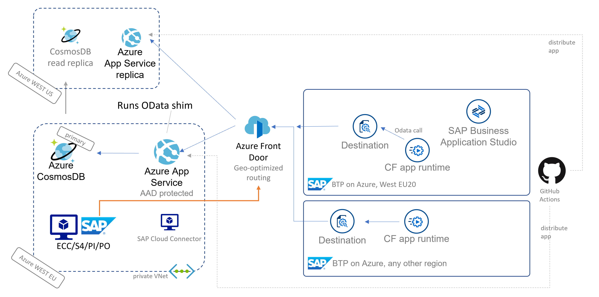

# sap-cap-cosmos-app
SAP Cloud Application Programming (CAP) model implementation of Azure CosmosDB OData proxy integration. The cds service serves as proxy to the CloudFoundry destination and ultimately the OData services exposed by the .NET web api running in Azure, which collects data from Azure CosmosDB. The SAPUI5 part of the application is identical to the non-cap implementation [here](https://github.com/MartinPankraz/SAPUI5-CosmosDB-umbrella).

Additional Resources |
--- |
[blog on the SAP community](https://blogs.sap.com/2021/06/11/sap-where-can-i-get-toilet-paper-an-implementation-of-the-geodes-pattern-with-s4-btp-and-azure-cosmosdb/) |
[OData web api project](https://github.com/MartinPankraz/AzCosmosDB-OData-Shim) |
[SAPUI5 freestyle client](https://github.com/MartinPankraz/SAPUI5-CosmosDB-umbrella) |
[CI/CD pipelines on AzDevOps](https://dev.azure.com/mapankra/CosmosDB%20OData%20SAP%20umbrella) |
<br>



## How to run
From your IDE run `cds watch` (consider default-env.json when using CF destination)

## How to debug
Create Run configuration on SAP BAS and execute or use process attach on VSC. I found [this](https://developers.sap.com/tutorials/appstudio-cap-app.html#61399eba-7ffb-4764-b8bd-4e6036c18e19) link useful.

## How to deploy
Login with your CloudFoundry space, run
```
mbt build
```
and finally
```
cf deploy mta_archives/cap-cosmosdb-app_1.0.0.mtar
```
